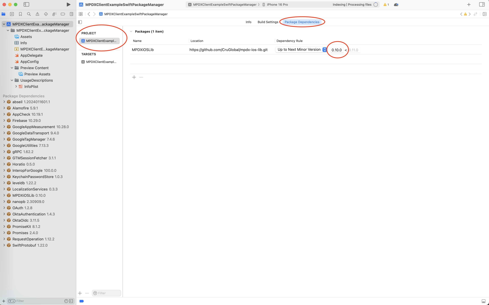
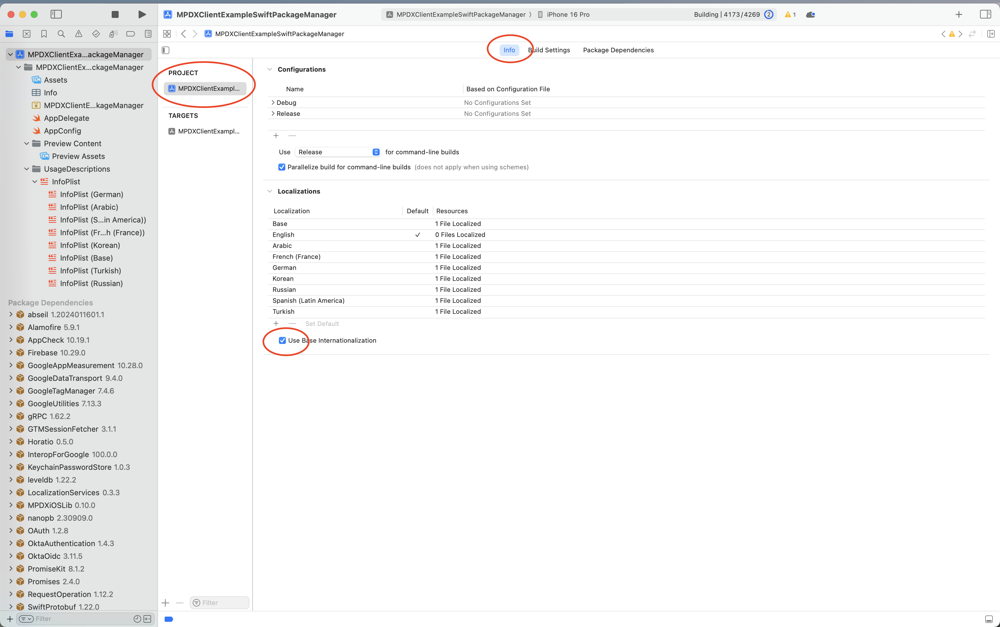
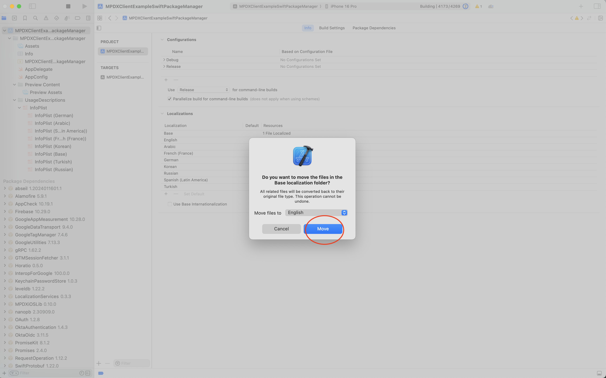
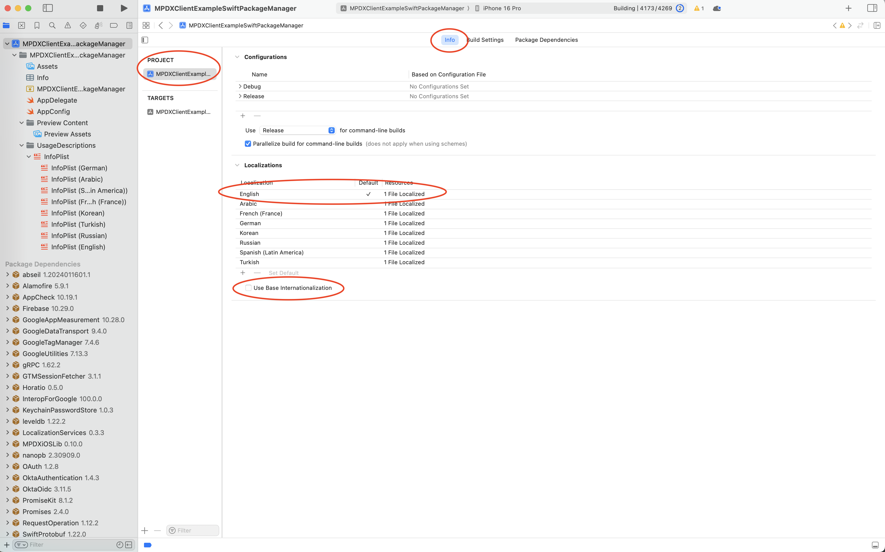
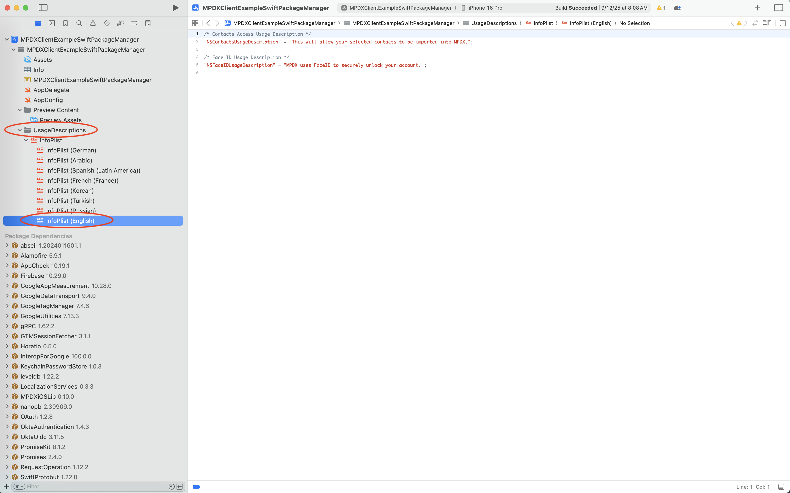
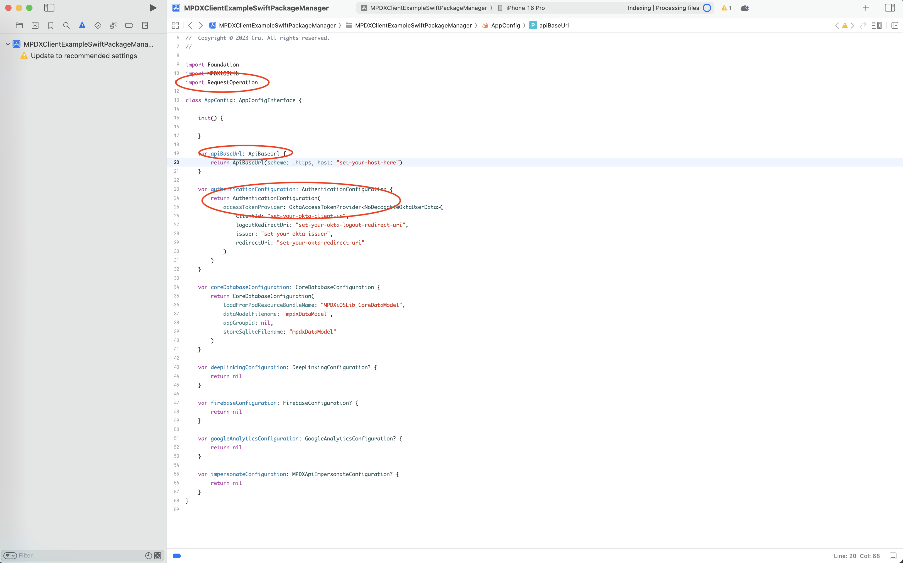

# MPDX iOS Lib 0.10.0 Migration Guide
MPDXiOSLib 0.10.0 is the latest major release of MPDXiOSLib.

This guide is provided in order to ease the transition of existing applications to MPDXiOSLib version 0.10.0.

Below are the following steps needed when upgrading to MPDXiOSLib 0.10.0.

##### 1) Upgrade MPDXiOSLib to min version 0.10.0.
- Ensure MPDXiOSLib dependency is being pulled in via swift package manager and min version is 0.10.0.
   

##### 2) Ensure uses base internationalization is unchecked.
- Locate Use Base Internationalization and uncheck.
   
- Choose Move when prompted to move to English.
   
- Use Base Internationalization should now be unchecked and you should see 1 file localized in English.
   
- Your Usage Descriptions should also have English now instead of Base.
   

##### 3) Update implementation for AppConfigInterface.

- Import RequestOperation.
- apiBaseUrl: String type changed to apiBaseUrl: ApiBaseUrl.
- AuthenticationConfiguration init argument label also changed to accessTokenProvider.
   